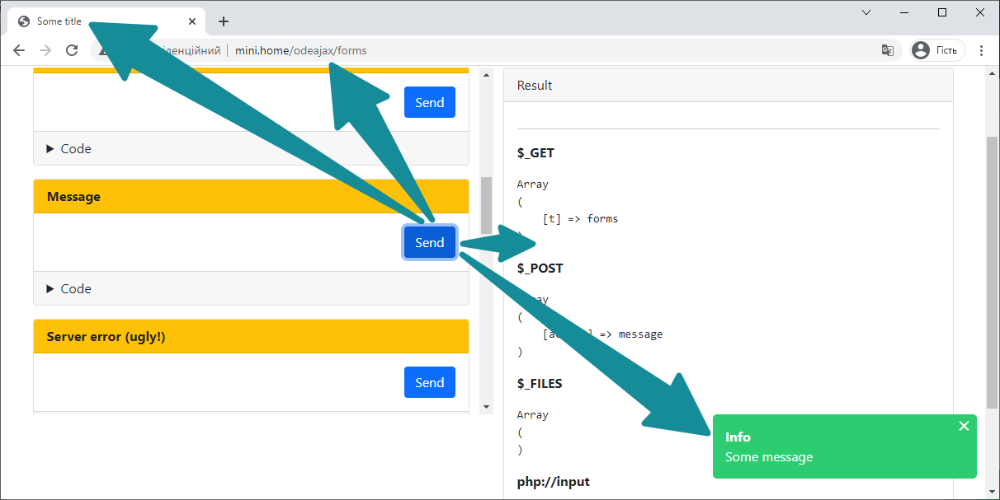

# Simple general Ajax website

Purpose: JS script for generalized Ajax website behavior, where an Ajax request updates content of one element of the document, document title and browser history (if that one element is "main"), and also shows alerts. 



HTML-code requires **#main** element and **data-oa[-...]** attributes for control elements.   

```html
<nav>
    <a href="[...]" data-oa>
        [...Menu item...]
    </a>
</nav>
<main id="main">
    <form method="post" action="[...]" data-oa>
        [...]
    </form>
    
    <div id="not-main">
    	<a href="[...]" data-oa data-oa-target="#not-main">
            [...]
        </a>
    </div>
</main>
```

Expected server response on traditional requests:

```html
<html>
    <head>
        <title>%TITLE%</title>
        [...]
        <script src="[...]docready.js"></script>
    </head>
    <body>
        [...]
        <main id="main">%CONTENT%</main>
        [...]
        <script src="[...]notify.min.js?v=[...]"></script>
        <script src="[...]odeajax.min.js?v=[...]"></script>
        [...]
    </body>
</html>
```

Expected server response on successful Ajax requests:

```json
{
    "success":"true",
    "title":"%TITLE%",
    "html":"%CONTENT%",
    "alerts":[
        {
            "title":"...",
            "text":"...",
            "function":"success"
        }
    ]
}
```

| Attribute               | Description                                                  |
| ----------------------- | ------------------------------------------------------------ |
| data-oa                 | triggers ajax request                                        |
| data-oa-target          | selector of an element which will receive the HTML part of a server response. Default value: *#main*<br />If a value is a semicolon-separated list (*"#submain;#main"*), response goes into the first element found on a page<br />If not given, response goes to the closest *[data-oa-main]* element, and if such doesn't exist — to the *#main* |
| data-oa-history         | if present (or if *data-oa-target* is *#main*), this URL will be added to browser history |
| data-oa-scroll          | selector of an element that will be scrolled into view after a successful request. <br/>If present without value, *data-oa-target* element will be scrolled into view |
| data-oa-submit          | attribute for A, INPUT, SELECT nodes which must submit forms<br />"A" node outside of needed form has to have a form selector as a value (*data-oa-submit="#form-id"*) |
|                         |                                                              |
| data-oa-append          | scroll to the bottom of the *data-oa-target* element, append the HTML response instead of inserting |
| data-oa-before          | function to execute before the AJAX request. If return FALSE, exit |
| data-oa-callback        | function to execute after the AJAX request and a main callback |
| data-oa-confirm         | text of a confirmation question                              |
| data-oa-prepend         | scroll to the top of the *data-oa-target* element, prepend the HTML response instead of inserting |
| data-oa-reset-on-cancel | reset form if AJAX request didn't pass confirmation (used with *data-oa-confirm*) |
| data-oa-timeout         | timeout duration of AJAX request in ms (30000ms by default)  |

## Server response

| Field   | Type                                                  | Description                                                  |
| ------- | ----------------------------------------------------- | ------------------------------------------------------------ |
| success | bool                                                  | if FALSE, HTML-part want be shown                            |
| html    | text                                                  | HTML-part to fill in the element, specified in *data-oa-target* (or the closest *[data-oa-main]* to the element that triggered the call, or *#main*) |
| alerts  | [{"title":"...", "text":"...", "function":"..."},...] | alerts, that will be shown with Vanilla Notify               |
| title   | text                                                  | will replace a document title, if *data-oa-history = TRUE*   |

## Additionals

Taken without asking permit

| Files          | Description                               |
| -------------- | ----------------------------------------- |
| docready.js    | https://github.com/jfriend00/docReady     |
| vanilla-notify | https://github.com/MLaritz/Vanilla-Notify |

## Examples

- Link

```html
<a href="[...]" data-oa data-oa-target="#target;#main" data-oa-history data-oa-scroll="#target">
    [...]
</a>
```

- Form

```html
<form method="post" action="[...]" data-oa>
    [...]
</form>
```

- Form with a custom submitter

```html
<form method="post" action="[...]" data-oa>
    [...]
    <a href="javascript:void(0)" data-oa-submit>[...]</a>
    [...]
</form>
```

- Form with a custom submitter outside of this form

```html
<form id="form-id" method="post" action="[...]" data-oa>
    [...]
</form>
[...]
<a href="javascript:void(0)" data-oa-submit="#form-id">[...]</a>
```

- When a form is submitted, ask for confirmation, and reset this form, if not confirmed

```html
<form method="post" action="[...]" data-oa data-oa-confirm="Are you sure?" data-oa-reset-on-cancel>
    <input type="checkbox" [checked] data-oa-submit>
</form>
```

- Custom timeout, ms

```html
<form method="post" action="[...]" data-oa data-oa-timeout="4000">
    [...]
</form>
```

- Insert HTML-response into an element, other than *#main*

```html
<div id="result">
	<form method="post" action="[...]" data-oa data-oa-target="#result">
    	[...]
	</form>
</div>
```
```html
<div data-oa-main>
	<form method="post" action="[...]" data-oa>
    	[...]
	</form>
</div>
```

```html
<!-- Attention: Form element will not be changed after a request -->
<form method="post" action="[...]" data-oa data-oa-target="#result">
    [...]
</form>
<div id="result"></div>
```

```html
<!-- Scroll #result into view -->
<form method="post" action="[...]" data-oa data-oa-target="#result" data-oa-scroll>
    [...]
</form>
<div id="result"></div>
```

- Append/prepend HTML-response to the current content of the target element

```html
<form method="post" action="[...]" data-oa data-oa-append>
    [...]
</form>
```

```html
<form method="post" action="[...]" data-oa data-oa-prepend>
    [...]
</form>
```

## PHP index – general idea

```php
<?php

// ————————————————————————————————————————————————————————————————————————————————
// Is this an AJAX request
// ————————————————————————————————————————————————————————————————————————————————
if (isset($_SERVER['HTTP_X_REQUESTED_WITH']) and $_SERVER['HTTP_X_REQUESTED_WITH'] === 'XMLHttpRequest') define('AJAX', true);

// ————————————————————————————————————————————————————————————————————————————————
// Common vars
// ————————————————————————————————————————————————————————————————————————————————
$title = '[...]';
$success = $_SERVER['REQUEST_METHOD'] !== 'POST';

// ————————————————————————————————————————————————————————————————————————————————
// Preparation for alerts
// ————————————————————————————————————————————————————————————————————————————————
session_start();
$GLOBALS['msgbox'] = [];

// ————————————————————————————————————————————————————————————————————————————————
// Content
// ————————————————————————————————————————————————————————————————————————————————
ob_start();
include 'some-content.php';
$content = ob_get_clean();

// ————————————————————————————————————————————————————————————————————————————————
// Alerts - in case of redirect, add alerts from the execution before redirect  
// ————————————————————————————————————————————————————————————————————————————————
if (isset($_SESSION['msgbox']) and !empty($_SESSION['msgbox'])) {
	$GLOBALS['msgbox'] = array_merge($_SESSION['msgbox'], $GLOBALS['msgbox']);
	unset($_SESSION['msgbox']);
}

// ————————————————————————————————————————————————————————————————————————————————
// If this is AJAX request, return JSON-structure
// ————————————————————————————————————————————————————————————————————————————————
if (defined('AJAX')) {
    header('Content-Type: application/json; charset=utf-8');
	echo json_encode([
		'alerts'	=>	$GLOBALS['msgbox']??null,
		'html'		=>	$content,
		'title'		=>	$title,
		'success'	=>	$success,
	]);
	exit();
}

// ————————————————————————————————————————————————————————————————————————————————
// Full document
// ————————————————————————————————————————————————————————————————————————————————
?><!DOCTYPE html>
<html>
<head>
    <title><?=$title?></title>
	[...]
	<script src="vendor/docready.js"></script>
</head>
<body>
	<nav>
    	<a href="/home" data-oa>Home</a>
		[...]
	</nav>
	<main class="container" id="main"><?=$content?></main>

	<script src="vendor/vanilla-notify/vanilla-notify.min.js"></script>
	<script src="js/odeajax.min.js?v=[...]"></script>
	<?php if ($GLOBALS['msgbox']): ?>
	<script>
	docReady(() => ODEAJAX.showAlerts(<?=json_encode($GLOBALS['msgbox'])?>))
	</script>
	<?php endif ?>
</body>
</html>

```

## Changes in v1.0.4

- **doAjax(options)** changed to **doAjax(url, options)**

- **doForm(event)** replaced with **submit(form)**

- **Vanilla Notify** from https://github.com/MLaritz/Vanilla-Notify rewritten into **notify.js** which uses Bootstrap 5 toast classes and JS functionality (thus, no separate styles). Specifically, **error** function renamed to **danger**

- Server JSON response requires an appropriate header: 
  ```php
  header('Content-Type: application/json; charset=utf-8');
  ```

- **XMLHttpRequest** replaced with **fetch**
